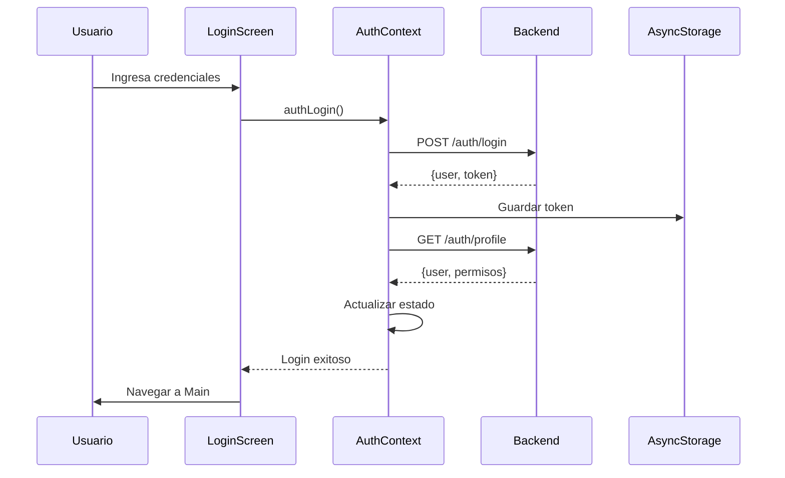

# Agrotech Mobile - Auth & Activities Complete

## ✅ Cambios Implementados

### 1. Sistema de Autenticación Mejorado

#### AuthContext Actualizado
- ✅ Carga automática de permisos desde el perfil del usuario
- ✅ Función `refreshProfile()` para recargar permisos después de cambios
- ✅ Manejo robusto de errores de autenticación
- ✅ Validación de token con endpoint `/auth/profile`

#### Hooks de Permisos
Creado `src/shared/hooks/usePermissions.ts` con los siguientes hooks:

```typescript
// Verificar un permiso específico
const canCreate = usePermission('actividades:crear');

// Verificar si tiene al menos uno de varios permisos
const canManage = useHasAnyPermission(['actividades:crear', 'actividades:editar']);

// Verificar si tiene todos los permisos
const isAdmin = useHasAllPermissions(['actividades:crear', 'actividades:editar', 'actividades:eliminar']);

// Verificar rol
const isProductor = useHasRole('Productor');
```

#### LoginScreen Mejorado
- ✅ Mensajes específicos para credenciales inválidas (401)
- ✅ Diferenciación entre errores de autenticación y otros errores
- ✅ Mejor experiencia de usuario con mensajes claros

### 2. Módulo de Actividades Completo

El módulo de actividades ya está completamente implementado con:

#### Funcionalidades Principales
- ✅ **CRUD Completo**: Crear, leer, actualizar y eliminar actividades
- ✅ **Gestión de Responsables**: Agregar/editar/eliminar responsables con horas y tarifa
- ✅ **Gestión de Insumos**: Control de insumos usados con cantidad y costo
- ✅ **Gestión de Servicios**: Registro de servicios contratados
- ✅ **Evidencias**: Subida de imágenes como evidencia de actividades
- ✅ **Cambio de Estado**: Marcar actividades como Pendiente/Finalizada
- ✅ **Cálculo de Costos**: Resumen automático de costos totales

#### Pantallas
1. **ActivitiesListScreen**: Lista con filtros y búsqueda
2. **ActivityFormScreen**: Formulario para crear/editar
3. **ActivityDetailScreen**: Vista detallada con tabs para cada sección

#### Componentes
- `ActivityCard`: Tarjeta de actividad en la lista
- `ResponsableItem`: Item de responsable con acciones
- `InsumoItem`: Item de insumo con acciones
- `ServicioItem`: Item de servicio con acciones
- `EvidenciaCard`: Tarjeta de evidencia con imagen
- `CostSummary`: Resumen de costos
- Modales para agregar/editar cada tipo de recurso

#### Filtros Disponibles
- Por estado (Pendiente/Finalizada)
- Por tipo de actividad (Creación/Mantenimiento/Finalización)
- Por subtipo
- Por lote
- Por cultivo
- Por rango de fechas
- Búsqueda por texto

### 3. Ejemplo de Uso de Permisos en Actividades

```typescript
import { usePermission } from '../../../shared/hooks/usePermissions';

const ActivitiesListScreen = () => {
  const canCreate = usePermission('actividades:crear');
  const canEdit = usePermission('actividades:editar');
  const canDelete = usePermission('actividades:eliminar');

  return (
    <View>
      {canCreate && (
        <TouchableOpacity onPress={handleNew}>
          <Text>Nueva Actividad</Text>
        </TouchableOpacity>
      )}
      
      {activities.map(activity => (
        <ActivityCard
          key={activity.id}
          activity={activity}
          onEdit={canEdit ? handleEdit : undefined}
          onDelete={canDelete ? handleDelete : undefined}
        />
      ))}
    </View>
  );
};
```

## 🔐 Permisos del Sistema

### Estructura de Permisos
Los permisos siguen el formato: `modulo:accion`

Ejemplos:
- `actividades:crear`
- `actividades:editar`
- `actividades:eliminar`
- `actividades:ver`
- `usuarios:crear`
- `usuarios:editar`
- `roles:asignar`

### Cómo Funcionan

1. **Backend**: El backend devuelve los permisos en el endpoint `/auth/profile`
2. **Frontend**: El AuthContext carga y almacena los permisos del usuario
3. **Hooks**: Los hooks de permisos permiten verificar acceso en cualquier componente
4. **UI Condicional**: Los componentes muestran/ocultan funcionalidades según permisos

## 📱 Flujo de Autenticación



## 🚀 Próximos Pasos

1. **Implementar permisos en otros módulos**:
   - Geo (Lotes y Sublotes)
   - Cultivos
   - Inventario
   - Usuarios

2. **Agregar indicadores visuales**:
   - Badges de permisos en perfil
   - Tooltips explicando por qué una acción está deshabilitada

3. **Testing**:
   - Probar con diferentes roles
   - Verificar que los permisos se respetan correctamente

## 📝 Notas Técnicas

### Cookies vs Token
El backend maneja cookies HTTP-only para seguridad, pero también devuelve el token en el body para que la app móvil pueda almacenarlo en AsyncStorage y enviarlo en headers subsecuentes.

### Refresh de Permisos
Si los permisos de un usuario cambian mientras está logueado, puede llamar a `refreshProfile()` del AuthContext para recargarlos sin hacer logout.

```typescript
const { refreshProfile } = useAuth();

// Después de cambiar permisos
await refreshProfile();
```

### Manejo de Errores 401
Cuando el backend devuelve 401 (token expirado o inválido), el AuthContext automáticamente limpia la sesión y redirige al login.

## 🎯 Comandos Útiles

```bash
# Limpiar y reiniciar
npm run clean
npm start

# Ejecutar en Android
npm run android

# Ejecutar en iOS
npm run ios

# Ejecutar en Web
npm run web
```

## ✨ Características Destacadas

- 🔒 **Seguridad**: Validación de permisos en frontend y backend
- 🎨 **UI/UX**: Interfaz intuitiva con feedback claro
- 📊 **Costos**: Cálculo automático de costos por actividad
- 📸 **Evidencias**: Soporte para imágenes como evidencia
- 🔄 **Sincronización**: Refresh automático de datos
- 🎯 **Filtros**: Múltiples opciones de filtrado
- 📱 **Responsive**: Funciona en Android, iOS y Web
