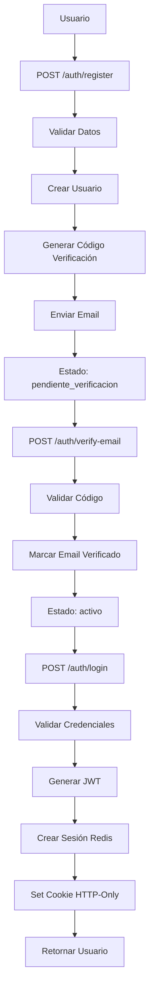
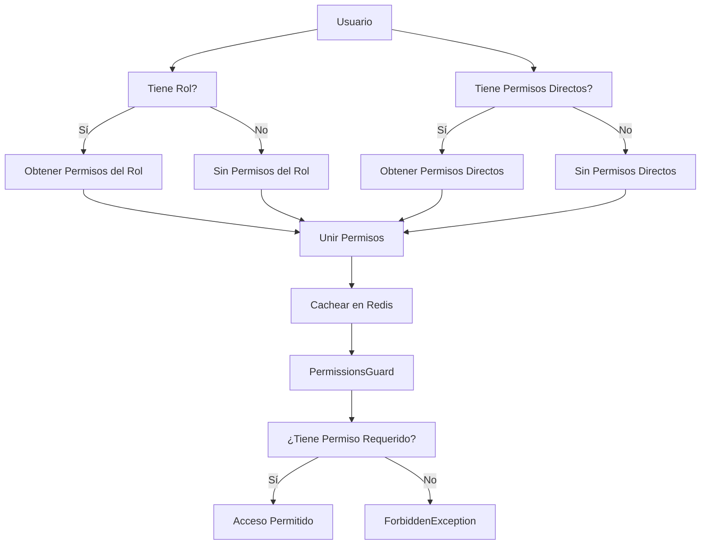
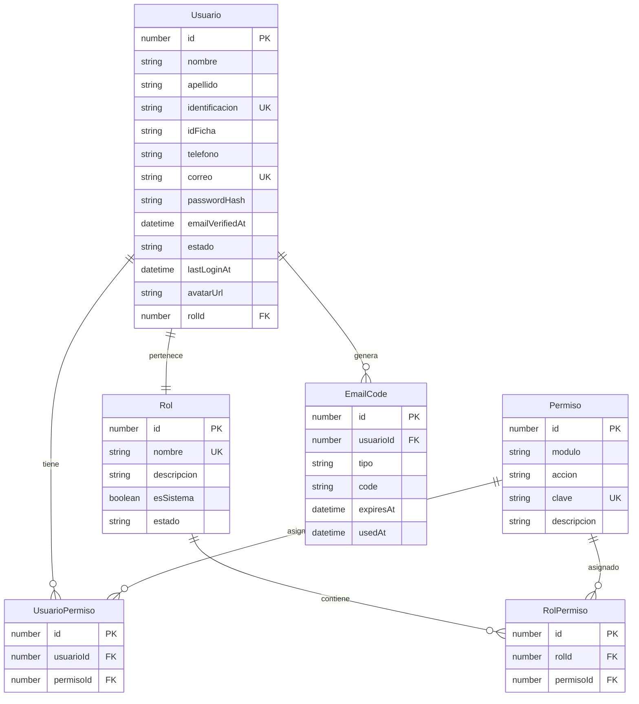

# API de Autenticación

## Visión General

El módulo de autenticación proporciona un sistema completo de gestión de usuarios, autenticación JWT, y control de permisos basado en roles. Incluye funcionalidades como registro de usuarios, verificación de email, recuperación de contraseña, y un sistema granular de permisos.

### Características Principales

- **Autenticación JWT**: Tokens seguros con expiración y blacklist
- **Sistema de Permisos**: Control granular basado en roles y permisos directos
- **Verificación de Email**: Proceso de verificación obligatorio para nuevos usuarios
- **Recuperación de Contraseña**: Sistema seguro de reset de contraseñas
- **Cache Redis**: Optimización de permisos y sesiones
- **Guards y Decorators**: Protección automática de endpoints

## Autenticación JWT

### Estructura del Token

Los tokens JWT contienen la siguiente información:

```json
{
  "correo": "usuario@example.com",
  "sub": 123,
  "rolId": 2,
  "jti": "uuid-session-id",
  "iat": 1640995200,
  "exp": 1641081600
}
```

- `correo`: Email del usuario
- `sub`: ID del usuario
- `rolId`: ID del rol asignado
- `jti`: ID único de sesión (para invalidación)
- `iat/exp`: Timestamps de emisión y expiración

### Cookies HTTP-Only

Los tokens se almacenan en cookies HTTP-only para mayor seguridad:

- **Nombre**: `auth_token`
- **HTTP-Only**: `true`
- **Secure**: `true` en producción
- **SameSite**: `lax`
- **MaxAge**: 24 horas

### Sesiones en Redis

Cada sesión activa se almacena en Redis con:
- **Clave**: `session:{jti}`
- **Valor**: ID del usuario
- **TTL**: 7 días

## Endpoints de Autenticación

### POST /auth/register
Registra un nuevo usuario en el sistema.

**Parámetros de entrada:**
```json
{
  "nombre": "string",
  "apellido": "string",
  "identificacion": "string",
  "idFicha": "string (opcional)",
  "telefono": "string (opcional)",
  "correo": "string",
  "password": "string"
}
```

**Validaciones:**
- Nombre: máximo 100 caracteres
- Apellido: máximo 100 caracteres
- Identificación: máximo 20 caracteres, única
- ID Ficha: máximo 20 caracteres (opcional)
- Teléfono: formato válido, máximo 20 caracteres (opcional)
- Correo: formato email válido, máximo 100 caracteres, único
- Password: mínimo 8 caracteres, debe contener mayúscula, minúscula y número

**Respuesta exitosa (201):**
```json
{
  "id": 123,
  "nombre": "Juan",
  "apellido": "Pérez",
  "identificacion": "123456789",
  "correo": "juan@example.com",
  "estado": "pendiente_verificacion",
  "createdAt": "2024-01-01T00:00:00.000Z"
}
```

#### Respuestas de Error

- **400 Bad Request**: Datos inválidos (campos requeridos faltantes, formatos inválidos como correo no válido o contraseña débil)
- **409 Conflict**: Correo electrónico ya en uso o identificación ya registrada
- **422 Unprocessable Entity**: Validación fallida en DTOs

### POST /auth/verify-email
Verifica el correo electrónico del usuario.

**Parámetros de entrada:**
```json
{
  "correo": "string",
  "code": "string"
}
```

**Respuesta exitosa (200):**
```json
{
  "message": "Correo verificado exitosamente"
}
```

#### Respuestas de Error

- **400 Bad Request**: Código de verificación inválido o expirado, correo ya verificado
- **404 Not Found**: Usuario no encontrado

### POST /auth/resend-verification
Reenvía el código de verificación al correo.

**Parámetros de entrada:**
```json
{
  "correo": "string"
}
```

**Respuesta exitosa (200):**
```json
{
  "message": "Código de verificación reenviado al correo"
}
```

#### Respuestas de Error

- **400 Bad Request**: Correo ya verificado
- **404 Not Found**: Usuario no encontrado

### POST /auth/login
Inicia sesión de usuario.

**Parámetros de entrada:**
```json
{
  "correo": "string",
  "password": "string"
}
```

**Respuesta exitosa (200):**
```json
{
  "user": {
    "id": 123,
    "correo": "juan@example.com",
    "nombre": "Juan",
    "apellido": "Pérez",
    "rolId": 2,
    "estado": "activo"
  }
}
```

#### Respuestas de Error

- **400 Bad Request**: Datos inválidos (correo o contraseña faltantes)
- **401 Unauthorized**: Credenciales inválidas, usuario inactivo o correo no verificado

### POST /auth/logout
Cierra la sesión del usuario actual.

**Respuesta exitosa (200):**
```json
{
  "message": "Logout exitoso"
}
```

#### Respuestas de Error

- **401 Unauthorized**: Token JWT inválido o expirado

### POST /auth/request-reset
Solicita un código de recuperación de contraseña.

**Parámetros de entrada:**
```json
{
  "correo": "string"
}
```

**Respuesta exitosa (200):**
```json
{
  "message": "Si el correo existe, recibirás un código de recuperación"
}
```

#### Respuestas de Error

- **400 Bad Request**: Correo faltante o formato inválido

### POST /auth/reset-password
Resetea la contraseña del usuario.

**Parámetros de entrada:**
```json
{
  "correo": "string",
  "code": "string",
  "nuevaPassword": "string"
}
```

**Respuesta exitosa (200):**
```json
{
  "message": "Contraseña actualizada exitosamente"
}
```

#### Respuestas de Error

- **400 Bad Request**: Datos faltantes, código inválido o expirado, contraseña no cumple requisitos de seguridad

## Endpoints de Gestión de Permisos

Todos los endpoints requieren autenticación JWT y permisos específicos.

### GET /permissions/permisos
Obtiene todos los permisos del sistema.

**Permisos requeridos:** `permisos.ver`

**Respuesta exitosa (200):**
```json
[
  {
    "id": 1,
    "modulo": "usuarios",
    "accion": "ver",
    "clave": "usuarios.ver",
    "descripcion": "Ver usuarios"
  }
]
```

#### Respuestas de Error

- **401 Unauthorized**: Token JWT inválido o expirado
- **403 Forbidden**: Permisos insuficientes (se requiere permisos.ver)

### POST /permissions/permisos
Crea un nuevo permiso.

**Permisos requeridos:** `permisos.crear`

**Parámetros de entrada:**
```json
{
  "modulo": "string",
  "accion": "string",
  "descripcion": "string (opcional)"
}
```

#### Respuestas de Error

- **400 Bad Request**: Datos inválidos (campos requeridos faltantes)
- **401 Unauthorized**: Token JWT inválido o expirado
- **403 Forbidden**: Permisos insuficientes (se requiere permisos.crear)
- **409 Conflict**: Permiso ya existe

### GET /permissions/roles
Obtiene todos los roles del sistema.

**Permisos requeridos:** `roles.ver`

**Respuesta exitosa (200):**
```json
[
  {
    "id": 1,
    "nombre": "Administrador",
    "descripcion": "Rol con permisos completos",
    "esSistema": true,
    "estado": "activo"
  }
]
```

#### Respuestas de Error

- **401 Unauthorized**: Token JWT inválido o expirado
- **403 Forbidden**: Permisos insuficientes (se requiere roles.ver)

### POST /permissions/roles
Crea un nuevo rol.

**Permisos requeridos:** `roles.crear`

**Parámetros de entrada:**
```json
{
  "nombre": "string",
  "descripcion": "string (opcional)"
}
```

#### Respuestas de Error

- **400 Bad Request**: Datos inválidos (nombre requerido)
- **401 Unauthorized**: Token JWT inválido o expirado
- **403 Forbidden**: Permisos insuficientes (se requiere roles.crear)
- **409 Conflict**: Rol ya existe

### DELETE /permissions/roles/:id
Elimina un rol (solo roles no del sistema).

**Permisos requeridos:** `roles.eliminar`

#### Respuestas de Error

- **400 Bad Request**: No se puede eliminar un rol del sistema
- **401 Unauthorized**: Token JWT inválido o expirado
- **403 Forbidden**: Permisos insuficientes (se requiere roles.eliminar)
- **404 Not Found**: Rol no encontrado

### GET /permissions/roles/:rolId/permisos
Obtiene los permisos asignados a un rol.

**Permisos requeridos:** `roles.ver`

#### Respuestas de Error

- **401 Unauthorized**: Token JWT inválido o expirado
- **403 Forbidden**: Permisos insuficientes (se requiere roles.ver)
- **404 Not Found**: Rol no encontrado

### POST /permissions/roles/:rolId/permisos/:permisoId
Asigna un permiso a un rol.

**Permisos requeridos:** `roles.asignar_permisos`

#### Respuestas de Error

- **401 Unauthorized**: Token JWT inválido o expirado
- **403 Forbidden**: Permisos insuficientes (se requiere roles.asignar_permisos)
- **404 Not Found**: Rol o permiso no encontrado
- **409 Conflict**: Permiso ya asignado al rol

### DELETE /permissions/roles/:rolId/permisos/:permisoId
Remueve un permiso de un rol.

**Permisos requeridos:** `roles.asignar_permisos`

#### Respuestas de Error

- **400 Bad Request**: Permiso no asignado al rol
- **401 Unauthorized**: Token JWT inválido o expirado
- **403 Forbidden**: Permisos insuficientes (se requiere roles.asignar_permisos)
- **404 Not Found**: Rol o permiso no encontrado

### POST /permissions/roles/:rolId/permisos/sync
Sincroniza todos los permisos de un rol.

**Permisos requeridos:** `roles.asignar_permisos`

**Parámetros de entrada:**
```json
{
  "permisoIds": [1, 2, 3]
}
```

#### Respuestas de Error

- **400 Bad Request**: Datos inválidos (permisoIds debe ser array de números)
- **401 Unauthorized**: Token JWT inválido o expirado
- **403 Forbidden**: Permisos insuficientes (se requiere roles.asignar_permisos)
- **404 Not Found**: Rol no encontrado

### GET /permissions/usuarios/:usuarioId/permisos/directos
Obtiene los permisos directos asignados a un usuario.

**Permisos requeridos:** `usuarios.ver_permisos`

#### Respuestas de Error

- **401 Unauthorized**: Token JWT inválido o expirado
- **403 Forbidden**: Permisos insuficientes (se requiere usuarios.ver_permisos)
- **404 Not Found**: Usuario no encontrado

### GET /permissions/usuarios/:usuarioId/permisos/efectivos
Obtiene todos los permisos efectivos de un usuario (rol + directos).

**Permisos requeridos:** `usuarios.ver_permisos`

#### Respuestas de Error

- **401 Unauthorized**: Token JWT inválido o expirado
- **403 Forbidden**: Permisos insuficientes (se requiere usuarios.ver_permisos)
- **404 Not Found**: Usuario no encontrado

### POST /permissions/usuarios/:usuarioId/permisos/:permisoId
Asigna un permiso directo a un usuario.

**Permisos requeridos:** `usuarios.asignar_permisos`

#### Respuestas de Error

- **401 Unauthorized**: Token JWT inválido o expirado
- **403 Forbidden**: Permisos insuficientes (se requiere usuarios.asignar_permisos)
- **404 Not Found**: Usuario o permiso no encontrado
- **409 Conflict**: Permiso ya asignado al usuario

### DELETE /permissions/usuarios/:usuarioId/permisos/:permisoId
Remueve un permiso directo de un usuario.

**Permisos requeridos:** `usuarios.asignar_permisos`

#### Respuestas de Error

- **400 Bad Request**: Permiso no asignado al usuario
- **401 Unauthorized**: Token JWT inválido o expirado
- **403 Forbidden**: Permisos insuficientes (se requiere usuarios.asignar_permisos)
- **404 Not Found**: Usuario o permiso no encontrado

## Entidades Relacionadas

### Usuario
```typescript
{
  id: number;
  nombre: string;
  apellido: string;
  identificacion: string;
  idFicha?: string;
  telefono?: string;
  correo: string;
  passwordHash: string;
  emailVerifiedAt?: Date;
  estado: string; // 'activo', 'inactivo', 'pendiente_verificacion'
  lastLoginAt?: Date;
  avatarUrl?: string;
  rolId?: number;
  rol?: Rol;
  usuarioPermisos?: UsuarioPermiso[];
  emailCodes?: EmailCode[];
}
```

### Rol
```typescript
{
  id: number;
  nombre: string;
  descripcion?: string;
  esSistema: boolean;
  estado: string;
  rolPermisos?: RolPermiso[];
}
```

### Permiso
```typescript
{
  id: number;
  modulo: string;
  accion: string;
  clave: string; // formato: "modulo.accion"
  descripcion?: string;
}
```

### RolPermiso
```typescript
{
  id: number;
  rolId: number;
  permisoId: number;
  rol?: Rol;
  permiso?: Permiso;
}
```

### UsuarioPermiso
```typescript
{
  id: number;
  usuarioId: number;
  permisoId: number;
  usuario?: Usuario;
  permiso?: Permiso;
}
```

### EmailCode
```typescript
{
  id: number;
  usuarioId: number;
  tipo: string; // 'verify' | 'reset'
  code: string;
  expiresAt: Date;
  usedAt?: Date;
  usuario?: Usuario;
}
```

## Sistema de Permisos

### Arquitectura de Permisos

El sistema implementa una arquitectura jerárquica de permisos:

1. **Permisos del Sistema**: Definidos por módulo y acción
2. **Roles**: Grupos de permisos asignables a usuarios
3. **Permisos Directos**: Asignaciones individuales a usuarios
4. **Permisos Efectivos**: Unión de permisos del rol + permisos directos

### Formato de Claves de Permiso

Las claves siguen el patrón: `modulo.accion`

**Ejemplos:**
- `usuarios.ver`
- `roles.crear`
- `permisos.eliminar`
- `actividades.asignar`

### Roles del Sistema

- **Invitado**: Rol por defecto para nuevos usuarios
- **Administrador**: Acceso completo al sistema
- **Operario**: Permisos limitados para operaciones diarias

### Cache de Permisos

Los permisos efectivos se cachean en Redis por 1 hora para optimizar performance:

- **Clave**: `user_permissions:{userId}`
- **Valor**: Array de claves de permisos
- **TTL**: 3600 segundos

## Middleware y Validaciones

### Guards

#### JwtAuthGuard
Valida la presencia y validez del token JWT.

#### PermissionsGuard
Verifica que el usuario tenga los permisos requeridos para el endpoint.

### Decorators

#### @RequirePermissions
Especifica los permisos requeridos para acceder a un endpoint.

```typescript
@RequirePermissions('usuarios.ver', 'usuarios.crear')
@Get('usuarios')
findAll() {
  // endpoint logic
}
```

### Validaciones Globales

- **Class-Validator**: Validaciones automáticas en DTOs
- **Transform**: Conversión automática de tipos
- **Whitelist**: Filtrado de propiedades no permitidas

### Filtros de Excepciones

- **AllExceptionsFilter**: Manejo global de errores
- **WsExceptionsFilter**: Manejo de errores en WebSockets

## Diagramas

### Diagrama de Flujo de Autenticación



### Diagrama de Sistema de Permisos



### Diagrama de Entidades



## Respuestas de Error

### Códigos de Estado HTTP

- **400 Bad Request**: Datos inválidos, código expirado/ya usado, contraseña no cumple requisitos
- **401 Unauthorized**: Credenciales incorrectas, usuario inactivo, email no verificado
- **403 Forbidden**: Permisos insuficientes
- **404 Not Found**: Usuario/rol/permiso no encontrado
- **409 Conflict**: Usuario ya existe, permiso ya asignado
- **422 Unprocessable Entity**: Validación fallida en DTOs

### Estructura de Errores

```json
{
  "statusCode": 400,
  "message": "Validation failed",
  "error": "Bad Request",
  "details": [
    {
      "field": "correo",
      "constraints": {
        "isEmail": "correo must be a valid email"
      }
    }
  ]
}
```

### Manejo de Errores Personalizados

- **BadRequestException**: Datos inválidos
- **UnauthorizedException**: No autorizado
- **ForbiddenException**: Permisos insuficientes
- **NotFoundException**: Recurso no encontrado
- **ConflictException**: Conflicto de datos