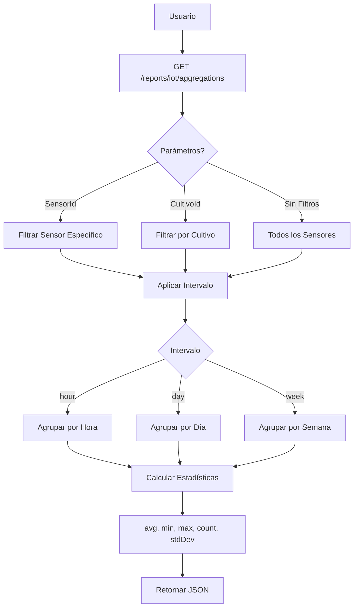
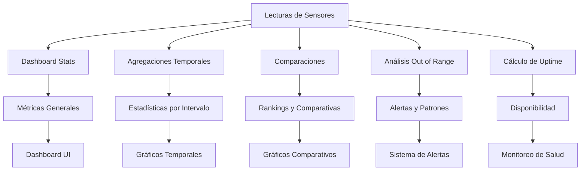

# API de Reportes IoT

## Visión General

El módulo de Reportes IoT proporciona endpoints especializados para análisis, estadísticas y exportación de datos de sensores. Incluye funcionalidades para dashboards, agregaciones temporales, comparaciones entre sensores, y exportación de reportes en formato CSV.

### Características Principales

- **Dashboard Estadístico**: Métricas generales del sistema IoT
- **Agregaciones Temporales**: Datos agrupados por hora, día o semana
- **Comparación de Sensores**: Análisis comparativo por tipo o cultivo
- **Exportación CSV**: Descarga de reportes en formato CSV
- **Estadísticas de Uptime**: Disponibilidad de sensores
- **Alertas Fuera de Rango**: Análisis de valores anómalos
- **Sparklines**: Datos simplificados para gráficos compactos
- **Filtros Avanzados**: Filtrado por Lote, SubLote y Sensor específico en todos los reportes

## Endpoints de Reportes

### GET /reports/iot/dashboard

Obtiene estadísticas generales del sistema IoT para el dashboard principal.

**Permisos requeridos:** `iot.ver`

**Respuesta exitosa (200):**

```json
{
  "totalSensors": 45,
  "activeSensors": 38,
  "inactiveSensors": 7,
  "connectedSensors": 35,
  "disconnectedSensors": 10,
  "alerts": 3,
  "totalReadings": 152847,
  "readingsToday": 4536,
  "avgReadingsPerSensor": 3396,
  "sensorsByProtocol": {
    "MQTT": 30,
    "HTTP": 12,
    "WEBSOCKET": 3
  },
  "sensorsByType": [
    {
      "tipoId": 1,
      "tipoNombre": "Temperatura",
      "count": 15,
      "avgValue": 24.5
    },
    {
      "tipoId": 2,
      "tipoNombre": "Humedad Relativa",
      "count": 12,
      "avgValue": 65.3
    },
    {
      "tipoId": 3,
      "tipoNombre": "pH",
      "count": 8,
      "avgValue": 6.5
    }
  ],
  "recentAlerts": [
    {
      "sensorId": 5,
      "sensorNombre": "Sensor Temp Invernadero 3",
      "valor": 35.2,
      "umbralMax": 30.0,
      "fecha": "2024-11-30T14:30:00.000Z"
    }
  ],
  "timestamp": "2024-11-30T15:00:00.000Z"
}
```

#### Respuestas de Error

- **401 Unauthorized**: Token JWT inválido o expirado
- **403 Forbidden**: Permisos insuficientes (se requiere iot.ver)

### GET /reports/iot/aggregations

Obtiene datos agregados de sensores por intervalos temporales.

**Permisos requeridos:** `iot.ver`

**Parámetros de consulta:**

- `sensorId` (opcional): ID del sensor específico
- `cultivoId` (opcional): ID del cultivo
- `from` (opcional): Fecha inicio (ISO 8601)
- `to` (opcional): Fecha fin (ISO 8601)
- `interval` (opcional): Intervalo de agrupación (`hour`, `day`, `week`)

**Ejemplos de solicitud:**

```
GET /reports/iot/aggregations?sensorId=1&interval=hour&from=2024-11-30T00:00:00Z&to=2024-11-30T23:59:59Z
GET /reports/iot/aggregations?cultivoId=5&interval=day&from=2024-11-01T00:00:00Z
GET /reports/iot/aggregations?interval=week
```

**Respuesta exitosa (200):**

```json
{
  "period": {
    "from": "2024-11-30T00:00:00.000Z",
    "to": "2024-11-30T23:59:59.000Z",
    "interval": "hour"
  },
  "filters": {
    "sensorId": 1,
    "cultivoId": null
  },
  "data": [
    {
      "timestamp": "2024-11-30T00:00:00.000Z",
      "sensorId": 1,
      "sensorNombre": "Sensor Temperatura Invernadero 1",
      "count": 60,
      "avg": 22.5,
      "min": 21.8,
      "max": 23.4,
      "sum": 1350.0,
      "stdDev": 0.45
    },
    {
      "timestamp": "2024-11-30T01:00:00.000Z",
      "sensorId": 1,
      "sensorNombre": "Sensor Temperatura Invernadero 1",
      "count": 60,
      "avg": 22.3,
      "min": 21.5,
      "max": 23.1,
      "sum": 1338.0,
      "stdDev": 0.52
    }
  ],
  "summary": {
    "totalRecords": 24,
    "avgValue": 23.1,
    "minValue": 21.5,
    "maxValue": 25.8,
    "totalReadings": 1440
  }
}
```

**Respuesta con múltiples sensores (sin sensorId específico):**

```json
{
  "period": {
    "from": "2024-11-01T00:00:00.000Z",
    "to": "2024-11-30T23:59:59.000Z",
    "interval": "day"
  },
  "data": [
    {
      "timestamp": "2024-11-01T00:00:00.000Z",
      "sensors": [
        {
          "sensorId": 1,
          "sensorNombre": "Sensor Temp Inv 1",
          "tipoSensor": "Temperatura",
          "avg": 23.5,
          "min": 18.2,
          "max": 28.4,
          "count": 1440
        },
        {
          "sensorId": 5,
          "sensorNombre": "Sensor Humedad Inv 1",
          "tipoSensor": "Humedad Relativa",
          "avg": 65.2,
          "min": 55.0,
          "max": 75.0,
          "count": 1440
        }
      ]
    }
  ]
}
```

#### Respuestas de Error

- **400 Bad Request**: Parámetros de fecha inválidos, intervalo no soportado
- **401 Unauthorized**: Token JWT inválido o expirado
- **403 Forbidden**: Permisos insuficientes (se requiere iot.ver)
- **404 Not Found**: Sensor o cultivo no encontrado

### GET /reports/iot/comparison

Compara el rendimiento de múltiples sensores.

**Permisos requeridos:** `iot.ver`

**Parámetros de consulta:**

- `tipoSensorId` (opcional): Comparar sensores del mismo tipo
- `cultivoId` (opcional): Filtrar por cultivo
- `from` (opcional): Fecha inicio
- `to` (opcional): Fecha fin
- `metric` (opcional): Métrica a comparar (`avg`, `min`, `max`, `count`) - default: `avg`
- `limit` (opcional): Cantidad máxima de sensores - default: 10

**Ejemplos de solicitud:**

```
GET /reports/iot/comparison?tipoSensorId=1&metric=avg&limit=5
GET /reports/iot/comparison?cultivoId=5&from=2024-11-01T00:00:00Z&to=2024-11-30T23:59:59Z
```

**Respuesta exitosa (200):**

```json
{
  "comparisonType": "tipo_sensor",
  "filters": {
    "tipoSensorId": 1,
    "tipoSensorNombre": "Temperatura",
    "cultivoId": null,
    "from": "2024-11-01T00:00:00.000Z",
    "to": "2024-11-30T23:59:59.000Z",
    "metric": "avg"
  },
  "data": [
    {
      "sensorId": 1,
      "sensorNombre": "Sensor Temp Invernadero 1",
      "value": 24.5,
      "count": 43200,
      "cultivoNombre": "Tomate Cherry",
      "loteNombre": "Lote A",
      "rank": 1
    },
    {
      "sensorId": 3,
      "sensorNombre": "Sensor Temp Invernadero 2",
      "value": 23.8,
      "count": 43180,
      "cultivoNombre": "Tomate Cherry",
      "loteNombre": "Lote B",
      "rank": 2
    },
    {
      "sensorId": 7,
      "sensorNombre": "Sensor Temp Exterior",
      "value": 18.2,
      "count": 43050,
      "cultivoNombre": null,
      "loteNombre": null,
      "rank": 3
    }
  ],
  "summary": {
    "totalSensors": 15,
    "showing": 3,
    "avgOfAll": 22.5,
    "highest": {
      "sensorId": 1,
      "value": 24.5
    },
    "lowest": {
      "sensorId": 7,
      "value": 18.2
    }
  }
}
```

#### Respuestas de Error

- **400 Bad Request**: Parámetros inválidos
- **401 Unauthorized**: Token JWT inválido o expirado
- **403 Forbidden**: Permisos insuficientes (se requiere iot.ver)
- **404 Not Found**: Tipo de sensor o cultivo no encontrado

### GET /reports/iot/export

Exporta reportes de IoT en formato CSV.

**Permisos requeridos:** `iot.ver`

**Parámetros de consulta:**

- `type` (opcional): Tipo de reporte (`aggregation`, `comparison`, `summary`) - default: `aggregation`
- Acepta todos los parámetros de los endpoints correspondientes

**Ejemplos de solicitud:**

```
GET /reports/iot/export?type=aggregation&sensorId=1&interval=day&from=2024-11-01T00:00:00Z
GET /reports/iot/export?type=comparison&tipoSensorId=1&metric=avg
GET /reports/iot/export?type=summary&tipoSensorId=1&from=2024-11-01T00:00:00Z&to=2024-11-30T23:59:59Z
```

**Respuesta exitosa (200):**

```csv
timestamp,sensorId,sensorNombre,tipoSensor,avg,min,max,count
2024-11-01T00:00:00.000Z,1,Sensor Temp Invernadero 1,Temperatura,23.5,18.2,28.4,1440
2024-11-02T00:00:00.000Z,1,Sensor Temp Invernadero 1,Temperatura,24.1,19.5,29.2,1440
2024-11-03T00:00:00.000Z,1,Sensor Temp Invernadero 1,Temperatura,22.8,17.8,27.5,1440
```

**Headers de respuesta:**

```
Content-Type: text/csv
Content-Disposition: attachment; filename=iot_aggregation.csv
```

#### Respuestas de Error

- **400 Bad Request**: Tipo de reporte no soportado, parámetros inválidos
- **401 Unauthorized**: Token JWT inválido o expirado
- **403 Forbidden**: Permisos insuficientes (se requiere iot.ver)

### GET /reports/iot/summary

Obtiene un reporte resumen de un tipo de sensor.

**Permisos requeridos:** `iot.ver`

**Parámetros de consulta (requeridos):**

- `tipoSensorId`: ID del tipo de sensor
- `from`: Fecha inicio (ISO 8601)
- `to`: Fecha fin (ISO 8601)

**Parámetros opcionales:**

- `cultivoId`: Filtrar por cultivo

**Ejemplo de solicitud:**

```
GET /reports/iot/summary?tipoSensorId=1&from=2024-11-01T00:00:00Z&to=2024-11-30T23:59:59Z
GET /reports/iot/summary?tipoSensorId=2&cultivoId=5&from=2024-11-15T00:00:00Z&to=2024-11-30T23:59:59Z
```

**Respuesta exitosa (200):**

```json
{
  "tipoSensor": {
    "id": 1,
    "nombre": "Temperatura",
    "unidades": "°C"
  },
  "period": {
    "from": "2024-11-01T00:00:00.000Z",
    "to": "2024-11-30T23:59:59.000Z",
    "days": 30
  },
  "filters": {
    "cultivoId": null
  },
  "generalStats": {
    "totalSensors": 15,
    "activeSensors": 14,
    "totalReadings": 648000,
    "avgReadingsPerDay": 21600,
    "avgValueGlobal": 23.4,
    "minValueGlobal": 12.5,
    "maxValueGlobal": 35.8
  },
  "sensorsSummary": [
    {
      "sensorId": 1,
      "sensorNombre": "Sensor Temp Invernadero 1",
      "cultivoNombre": "Tomate Cherry",
      "loteNombre": "Lote A",
      "readingsCount": 43200,
      "avgValue": 24.5,
      "minValue": 18.2,
      "maxValue": 30.1,
      "stdDev": 2.3,
      "uptime": 99.7,
      "alertsCount": 2
    },
    {
      "sensorId": 3,
      "sensorNombre": "Sensor Temp Invernadero 2",
      "cultivoNombre": "Tomate Cherry",
      "loteNombre": "Lote B",
      "readingsCount": 43100,
      "avgValue": 23.8,
      "minValue": 17.5,
      "maxValue": 29.4,
      "stdDev": 2.1,
      "uptime": 99.5,
      "alertsCount": 1
    }
  ],
  "trendsAnalysis": {
    "trend": "stable",
    "avgChangePerDay": 0.15,
    "volatility": "low"
  },
  "recommendations": [
    "El sensor ID 1 ha mostrado 2 alertas por temperatura alta",
    "Considerar ajustar umbrales en sensores de invernaderos durante horas pico"
  ]
}
```

#### Respuestas de Error

- **400 Bad Request**: Parámetros requeridos faltantes, fechas inválidas
- **401 Unauthorized**: Token JWT inválido o expirado
- **403 Forbidden**: Permisos insuficientes (se requiere iot.ver)
- **404 Not Found**: Tipo de sensor o cultivo no encontrado

### GET /reports/iot/sensors/:id/out-of-range

Obtiene estadísticas de valores fuera de rango para un sensor.

**Permisos requeridos:** `iot.ver`

**Respuesta exitosa (200):**

```json
{
  "sensorId": 1,
  "sensorNombre": "Sensor Temp Invernadero 1",
  "umbralMin": 15.0,
  "umbralMax": 30.0,
  "period": {
    "from": "2024-11-01T00:00:00.000Z",
    "to": "2024-11-30T23:59:59.000Z"
  },
  "stats": {
    "totalReadings": 43200,
    "readingsInRange": 42950,
    "readingsOutOfRange": 250,
    "percentageInRange": 99.42,
    "percentageOutOfRange": 0.58,
    "readingsBelowMin": 45,
    "readingsAboveMax": 205
  },
  "outOfRangeEvents": [
    {
      "id": 1523456,
      "valor": 32.5,
      "umbralExcedido": "max",
      "diferencia": 2.5,
      "fecha": "2024-11-30T14:30:00.000Z"
    },
    {
      "id": 1523120,
      "valor": 31.8,
      "umbralExcedido": "max",
      "diferencia": 1.8,
      "fecha": "2024-11-30T13:45:00.000Z"
    },
    {
      "id": 1522890,
      "valor": 13.2,
      "umbralExcedido": "min",
      "diferencia": 1.8,
      "fecha": "2024-11-30T06:15:00.000Z"
    }
  ],
  "patterns": {
    "mostFrequentHour": 14,
    "mostFrequentDay": "2024-11-15",
    "avgDuration": "15 minutos"
  }
}
```

#### Respuestas de Error

- **401 Unauthorized**: Token JWT inválido o expirado
- **403 Forbidden**: Permisos insuficientes (se requiere iot.ver)
- **404 Not Found**: Sensor no encontrado

### GET /reports/iot/sensors/:id/uptime

Obtiene estadísticas de disponibilidad (uptime) de un sensor.

**Permisos requeridos:** `iot.ver`

**Respuesta exitosa (200):**

```json
{
  "sensorId": 1,
  "sensorNombre": "Sensor Temp Invernadero 1",
  "period": {
    "from": "2024-11-01T00:00:00.000Z",
    "to": "2024-11-30T23:59:59.000Z",
    "days": 30
  },
  "uptimeStats": {
    "expectedReadings": 43200,
    "actualReadings": 43050,
    "missedReadings": 150,
    "uptimePercentage": 99.65,
    "downtimeMinutes": 150,
    "avgReadingsPerHour": 60,
    "maxGapMinutes": 25
  },
  "downtimeEvents": [
    {
      "start": "2024-11-15T14:30:00.000Z",
      "end": "2024-11-15T14:55:00.000Z",
      "durationMinutes": 25,
      "missedReadings": 25
    },
    {
      "start": "2024-11-22T09:00:00.000Z",
      "end": "2024-11-22T09:15:00.000Z",
      "durationMinutes": 15,
      "missedReadings": 15
    }
  ],
  "reliability": {
    "grade": "A",
    "description": "Excelente disponibilidad",
    "recommendation": "El sensor mantiene un rendimiento óptimo"
  }
}
```

#### Respuestas de Error

- **401 Unauthorized**: Token JWT inválido o expirado
- **403 Forbidden**: Permisos insuficientes (se requiere iot.ver)
- **404 Not Found**: Sensor no encontrado

### GET /reports/iot/sensors/:id/sparkline

Obtiene datos simplificados para gráficos sparkline (gráficos compactos).

**Permisos requeridos:** `iot.ver`

**Parámetros de consulta:**

- `limit` (opcional): Cantidad de puntos de datos - default: 20

**Ejemplo de solicitud:**

```
GET /reports/iot/sensors/1/sparkline?limit=50
```

**Respuesta exitosa (200):**

```json
{
  "sensorId": 1,
  "sensorNombre": "Sensor Temp Invernadero 1",
  "tipoSensor": "Temperatura",
  "unidades": "°C",
  "dataPoints": 20,
  "values": [
    23.5, 23.8, 24.1, 24.3, 24.5, 24.2, 23.9, 23.7, 23.5, 23.8, 24.0, 24.2,
    24.4, 24.6, 24.5, 24.3, 24.1, 23.9, 23.7, 23.5
  ],
  "timestamps": [
    "2024-11-30T15:00:00.000Z",
    "2024-11-30T14:57:00.000Z",
    "2024-11-30T14:54:00.000Z",
    "..."
  ],
  "summary": {
    "current": 23.5,
    "min": 23.5,
    "max": 24.6,
    "avg": 24.0,
    "trend": "stable"
  },
  "thresholds": {
    "min": 15.0,
    "max": 30.0,
    "status": "normal"
  }
}
```

#### Respuestas de Error

- **401 Unauthorized**: Token JWT inválido o expirado
- **403 Forbidden**: Permisos insuficientes (se requiere iot.ver)
- **404 Not Found**: Sensor no encontrado

## Intervalos de Agregación

### hour

Agrupa datos por hora. Útil para análisis del día actual o últimas 24 horas.

### day

Agrupa datos por día. Ideal para análisis semanales o mensuales.

### week

Agrupa datos por semana. Recomendado para análisis de tendencias a largo plazo.

## Métricas de Comparación

### avg

Valor promedio de las lecturas en el período.

### min

Valor mínimo registrado en el período.

### max

Valor máximo registrado en el período.

### count

Cantidad total de lecturas en el período.

## Tipos de Exportación CSV

### aggregation

Exporta datos agregados con estadísticas por intervalo temporal.

**Columnas:** timestamp, sensorId, sensorNombre, tipoSensor, avg, min, max, count, stdDev

### comparison

Exporta comparación entre sensores.

**Columnas:** sensorId, sensorNombre, tipoSensor, value, count, cultivoNombre, loteNombre, rank

### summary

Exporta resumen detallado de sensores por tipo.

**Columnas:** sensorId, sensorNombre, cultivoNombre, loteNombre, readingsCount, avgValue, minValue, maxValue, stdDev, uptime, alertsCount

## Diagramas

### Diagrama de Flujo de Agregaciones



### Diagrama de Análisis de Datos



## Casos de Uso

### Dashboard en Tiempo Real

```
GET /reports/iot/dashboard
```

Muestra métricas generales, sensores activos, y alertas recientes.

### Análisis de Tendencia Semanal

```
GET /reports/iot/aggregations?sensorId=1&interval=day&from=2024-11-01&to=2024-11-07
```

Analiza el comportamiento de un sensor durante una semana.

### Comparación de Sensores de Temperatura

```
GET /reports/iot/comparison?tipoSensorId=1&metric=avg&limit=10
```

Compara el rendimiento promedio de los 10 sensores de temperatura.

### Exportar Reporte Mensual

```
GET /reports/iot/export?type=aggregation&interval=day&from=2024-11-01&to=2024-11-30
```

Descarga CSV con datos diarios del mes.

### Monitorear Alertas de un Sensor

```
GET /reports/iot/sensors/5/out-of-range
```

Revisa valores fuera de rango y patrones de alertas.

### Verificar Disponibilidad de Sensor Crítico

```
GET /reports/iot/sensors/1/uptime
```

Analiza la disponibilidad y eventos de downtime.

## Códigos de Error HTTP

- **400 Bad Request**: Parámetros inválidos, fechas mal formateadas, tipo de reporte no soportado
- **401 Unauthorized**: Token JWT inválido o expirado
- **403 Forbidden**: Permisos insuficientes
- **404 Not Found**: Sensor, tipo de sensor o cultivo no encontrado

### Estructura de Errores

```json
{
  "statusCode": 400,
  "message": "tipoSensorId, from, and to are required",
  "error": "Bad Request"
}
```

## Optimización y Performance

### Cacheo

- Los reportes de dashboard se cachean por 5 minutos
- Las agregaciones se cachean según el intervalo:
  - `hour`: 5 minutos
  - `day`: 1 hora
  - `week`: 6 horas

### Límites de Datos

- Agregaciones: Máximo 1000 registros por solicitud
- Comparaciones: Máximo 100 sensores
- Sparkline: Máximo 100 puntos de datos
- Exportación CSV: Sin límite, pero se recomienda usar filtros de fecha

### Recomendaciones

- Use filtros de fecha para reducir el volumen de datos
- Prefiera intervalos más grandes (`week`) para períodos largos
- Use `sparkline` para visualizaciones compactas
- Cache los resultados en el frontend cuando sea posible
