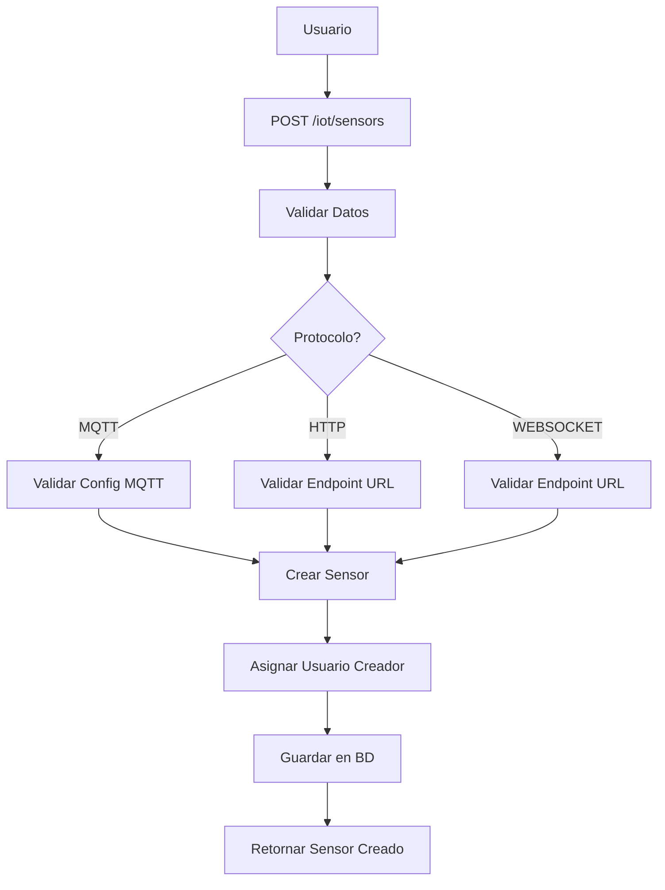
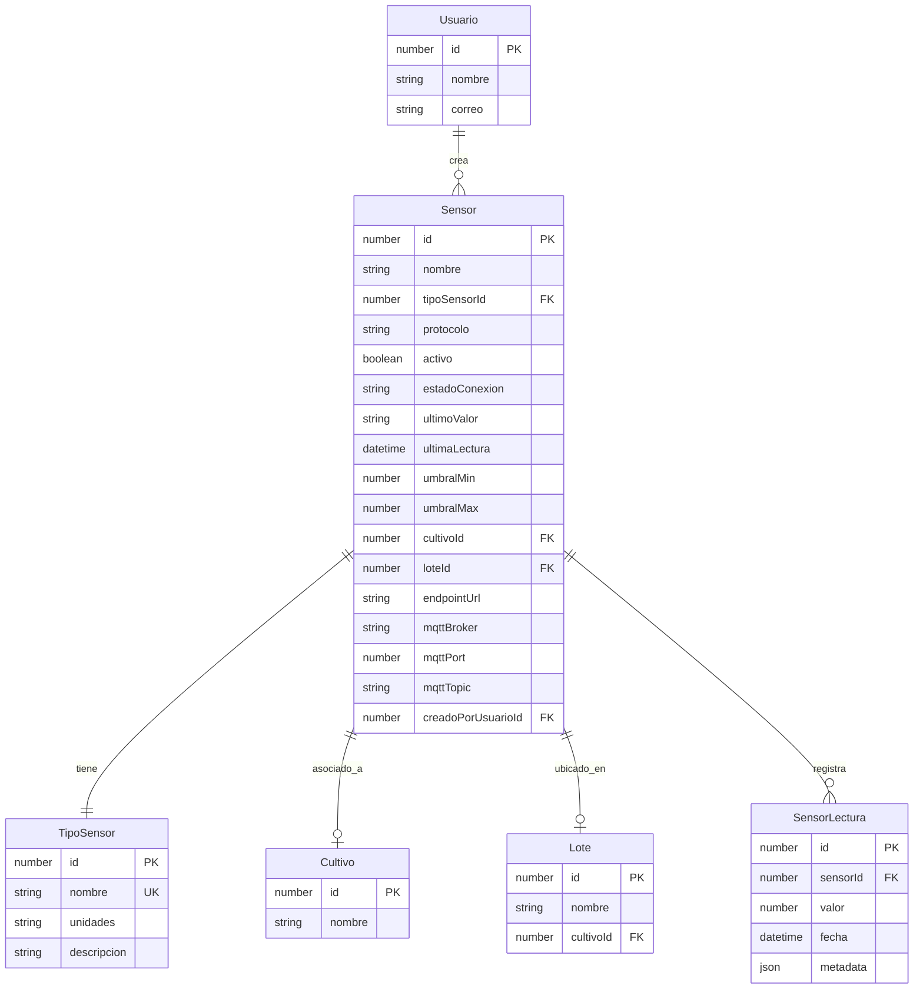

# API de IoT (Sensores)

## Visión General

El módulo IoT proporciona un sistema completo de **auto-descubrimiento y gestión de sensores MQTT**. Los sensores se descubren automáticamente cuando publican datos en topics MQTT configurados, y el sistema crea tanto el tipo de sensor como el sensor de forma automática.

### Características Principales

- **Auto-Descubrimiento MQTT**: Los sensores se crean automáticamente al detectar publicaciones en topics configurados
- **Configuración Global**: Define broker MQTT, topics y prefijos para el descubrimiento automático
- **Gestión Manual**: Edición y actualización de sensores auto-descubiertos
- **Múltiples Protocolos**: Soporte para MQTT (auto-discovery), HTTP y WebSocket
- **Lecturas en Tiempo Real**: Registro automático de mediciones desde MQTT
- **Umbrales Configurables**: Alertas por valores fuera de rango
- **Estado de Conexión**: Monitoreo de sensores activos/inactivos basado en TTL
- **Integración con Cultivos**: Asociación de sensores a lotes y cultivos

### Estados de Conexión y TTL

El sistema monitorea la salud de los sensores utilizando un mecanismo de **TTL (Time To Live)** definido en el `TipoSensor`.

- **CONECTADO**: El sensor ha enviado al menos una lectura dentro de su ventana de TTL (ej: últimos 5 minutos).
- **DESCONECTADO**: No se han recibido lecturas por un tiempo mayor al `ttlMinutos` definido. Un proceso en segundo plano verifica esto cada minuto.
- **DESCONOCIDO**: Estado inicial de un sensor recién creado que aún no ha reportado datos.

### Flujo de Trabajo

1. **Configurar Broker MQTT Global** (`POST /iot/config`)

   - Define el broker MQTT, puerto, credenciales
   - Configura `defaultTopics` (temperatura, humedadAire, etc.)
   - Opcionalmente agrega `customTopics`

2. **Auto-Descubrimiento Automático**

   - Cuando un dispositivo publica en `agrotech/temperatura`, el sistema:
     - Crea automáticamente un `TipoSensor` llamado "temperatura"
     - Crea un `Sensor` asociado a ese topic
     - Comienza a registrar lecturas automáticamente

3. **Gestión Manual de Sensores** (Opcional)
   - Editar sensores auto-descubiertos (`PATCH /iot/sensors/:id`)
   - Crear sensores manualmente (`POST /iot/sensors`)
   - Configurar umbrales, asociar a cultivos/lotes
   - Activar/desactivar sensores

## Endpoints de Configuración Global

> **IMPORTANTE**: La configuración global es el primer paso para usar el sistema IoT. Define el broker MQTT y los topics para auto-descubrimiento de sensores.

### GET /iot/config

Obtiene la configuración global del sistema IoT.

**Permisos requeridos:** `iot.ver`

**Respuesta exitosa (200):**

```json
{
  "broker": "test.mosquitto.org",
  "port": 1883,
  "protocol": "mqtt",
  "loteId": 1,
  "subLoteId": null,
  "topicPrefix": "agrotech/",
  "defaultTopics": [
    "temperatura",
    "humedadAire",
    "humedadSuelo",
    "estadoBomba"
  ],
  "customTopics": ["sensor/extra1"],
  "username": "",
  "password": "",
  "autoDiscover": true,
  "activo": true,
  "defaultSensorsInitialized": true
}
```

**Campos**:

- `broker`: Dirección del broker MQTT (ej: `mqtt.agrotech.com`)
- `port`: Puerto del broker (típicamente 1883)
- `protocol`: Protocolo (usualmente "mqtt")
- `loteId`: ID de lote por defecto para sensores auto-descubiertos
- `subLoteId`: ID de sublote por defecto (opcional)
- `topicPrefix`: Prefijo que se agrega a todos los topics (ej: "agrotech/")
- `defaultTopics`: Topics predefinidos para auto-descubrimiento
- `customTopics`: Topics personalizados adicionales
- `username`, `password`: Credenciales MQTT (opcionales)
- `autoDiscover`: Habilita/deshabilita la creación automática de sensores al recibir mensajes
- `activo`: Estado general de la conexión al broker

#### Respuestas de Error

- **401 Unauthorized**: Token JWT inválido o expirado
- **403 Forbidden**: Permisos insuficientes (se requiere iot.ver)

### POST /iot/config

Guarda la configuración global del sistema IoT. Al guardar, el sistema se reconecta al broker MQTT y comienza a escuchar los topics configurados para auto-descubrimiento.

**Permisos requeridos:** `iot.editar`

**Parámetros de entrada:**

```json
{
  "broker": "string (opcional)",
  "port": "number (opcional)",
  "protocol": "string (opcional)",
  "loteId": "number (opcional)",
  "subLoteId": "number (opcional)",
  "topicPrefix": "string (opcional)",
  "defaultTopics": "array<string> (opcional)",
  "customTopics": "array<string> (opcional)",
  "username": "string (opcional)",
  "password": "string (opcional)",
  "autoDiscover": "boolean (opcional)",
  "activo": "boolean (opcional)"
}
```

### ¿Cómo funciona el Auto-Descubrimiento?

1. **Configuración**: Defines un broker MQTT y topics en `POST /iot/config`. Habilitas `autoDiscover: true`.
2. **Suscripción Automática**: El servidor se suscribe a:

   - `{topicPrefix}{defaultTopic}` para cada topic en `defaultTopics`
   - `{topicPrefix}{customTopic}` para cada topic en `customTopics`
   - Ejemplo: Si `topicPrefix="agrotech/"` y `defaultTopics=["temperatura"]`, se suscribe a `agrotech/temperatura`

3. **Detección de Mensajes**: Cuando un dispositivo publica en `agrotech/temperatura`:

   - El sistema busca si ya existe un sensor para ese topic
   - Si **NO existe** y `autoDiscover` está activo:
     - Determina el `TipoSensor` automáticamente basado en el nombre del topic (ej: "temperatura" -> `TEMPERATURA_AIRE`).
     - Crea un `Sensor` automáticamente con:
       - Nombre: "Sensor {topic} - {ConfigName}"
       - Topic: "agrotech/temperatura"
       - Config MQTT del broker global
   - Registra la lectura automáticamente

4. **Formato del Mensaje**: El dispositivo puede enviar:
   - JSON: `{"tipo": "TEMPERATURA_AIRE", "unidad": "°C", "valor": 25.5, "estado": "ACTIVO"}`
   - Valor simple (menos recomendado): `"25.5"`

> **NOTA**: Al eliminar un tópico de la configuración global, los sensores ya creados que usan ese tópico **NO** se eliminan ni se modifican automáticamente. El histórico de datos se mantiene. Si el usuario no desea seguir usando ese sensor, deberá desactivarlo manualmente.

## Endpoints de Gestión de Sensores

> **NOTA**: Estos endpoints son principalmente para **editar** sensores que ya fueron auto-descubiertos, o para crear sensores manualmente (HTTP/WebSocket) que no usan auto-discovery.

### Arquitectura de Sensores MQTT

Los sensores MQTT ahora funcionan con una arquitectura de **configuración centralizada**:

- **Configuración Global (`IotGlobalConfig`)**: Define el broker MQTT, puerto, credenciales, y prefijo de tópicos
- **Sensor**: Referencia una configuración global (`globalConfigId`) y define su tópico específico (`mqttTopic`)
- **Tópico Completo**: Se construye como `{globalConfig.topicPrefix}{sensor.mqttTopic}`

**Ventajas:**

- ✅ Un solo lugar para actualizar credenciales del broker
- ✅ Múltiples sensores comparten la misma configuración
- ✅ Cambiar de broker es tan simple como actualizar `globalConfigId`
- ✅ Menos repetición de datos en la base de datos

**Ejemplo:**

```
Global Config:
  - broker: "mqtt.agrotech.com"
  - topicPrefix: "agrotech/"

Sensor:
  - globalConfigId: 1
  - mqttTopic: "temperatura/inv1"

→ Tópico completo: "agrotech/temperatura/inv1"
```

### GET /iot/sensors

Obtiene la lista de todos los sensores del sistema.

Obtiene la lista de todos los sensores del sistema.

**Permisos requeridos:** `iot.ver`

**Parámetros de consulta:**

- `loteId` (opcional): Filtrar por ID de lote
- `subLoteId` (opcional): Filtrar por ID de sublote

**Respuesta exitosa (200):**

```json
[
  {
    "id": 1,
    "nombre": "Sensor Temperatura Invernadero 1",
    "tipoSensorId": 2,
    "protocolo": "MQTT",
    "activo": true,
    "estadoConexion": "CONECTADO",
    "ultimoValor": "24.5",
    "ultimaLectura": "2024-11-30T12:30:00.000Z",
    "lastSeenAt": "2024-11-30T12:30:00.000Z",
    "umbralMin": 15.0,
    "umbralMax": 30.0,
    "cultivoId": 5,
    "loteId": 3,
    "subLoteId": null,
    "mqttBroker": "broker.hivemq.com",
    "mqttPort": 1883,
    "mqttTopic": "agrotech/temp/invernadero1",
    "mqttQos": 0,
    "creadoPorUsuarioId": 1,
    "tipoSensor": {
      "id": 2,
      "nombre": "Temperatura",
      "unidad": "°C",
      "decimales": 2,
      "descripcion": "Sensor de temperatura ambiente",
      "ttlMinutos": 5
    },
    "cultivo": {
      "id": 5,
      "nombre": "Tomate Cherry"
    },
    "createdAt": "2024-11-01T10:00:00.000Z",
    "updatedAt": "2024-11-30T12:30:00.000Z"
  }
]
```

**Ejemplo de filtrado por Lote:**

`GET /iot/sensors?loteId=3`

**Ejemplo de filtrado por Sublote:**

`GET /iot/sensors?subLoteId=5`

#### Respuestas de Error

- **401 Unauthorized**: Token JWT inválido o expirado
- **403 Forbidden**: Permisos insuficientes (se requiere iot.ver)

### POST /iot/sensors

Crea un nuevo sensor en el sistema.

**Permisos requeridos:** `iot.crear`

**Parámetros de entrada:**

```json
{
  "nombre": "string (requerido)",
  "tipoSensorId": "number (opcional - se auto-detecta si no se proporciona)",
  "protocolo": "HTTP | MQTT | WEBSOCKET (requerido)",

  // Para sensores MQTT
  "globalConfigId": "number (REQUERIDO para MQTT)",
  "mqttTopic": "string (REQUERIDO para MQTT - solo el sufijo, sin prefijo)",

  // Para sensores HTTP/WebSocket
  "endpointUrl": "string (requerido para HTTP/WEBSOCKET)",

  // Relaciones opcionales
  "cultivoId": "number (opcional)",
  "loteId": "number (opcional)",
  "subLoteId": "number (opcional)",

  // Configuración de umbrales
  "umbralMin": "number (opcional)",
  "umbralMax": "number (opcional)",
  "ttlMinutos": "number (opcional, min: 1)",
  "descripcion": "string (opcional)"
}
```

**Ejemplo para sensor MQTT:**

```json
{
  "nombre": "Sensor Humedad Suelo Lote A",
  "tipoSensorId": 3,
  "protocolo": "MQTT",
  "globalConfigId": 1,
  "mqttTopic": "humedadSuelo/loteA",
  "loteId": 2,
  "umbralMin": 30.0,
  "umbralMax": 80.0
}
```

> **NOTA**: El tópico completo se construye como: `{globalConfig.topicPrefix}{sensor.mqttTopic}`
>
> Por ejemplo, si el Global Config tiene `topicPrefix: "agrotech/"` y el sensor tiene `mqttTopic: "humedadSuelo/loteA"`, el tópico completo será: `agrotech/humedadSuelo/loteA`

**Ejemplo para sensor HTTP:**

```json
{
  "nombre": "Estación Meteorológica Principal",
  "tipoSensorId": 1,
  "protocolo": "HTTP",
  "endpointUrl": "https://api.estacion.com/weather/current",
  "cultivoId": 1
}
```

**Respuesta exitosa (201):**

```json
{
  "id": 15,
  "nombre": "Sensor Humedad Suelo Lote A",
  "tipoSensorId": 3,
  "protocolo": "MQTT",
  "activo": true,
  "estadoConexion": "DESCONECTADO",
  "ultimoValor": null,
  "ultimaLectura": null,
  "lastSeenAt": null,
  "loteId": 2,
  "subLoteId": null,
  "umbralMin": 30.0,
  "umbralMax": 80.0,
  "cultivoId": null,
  "globalConfigId": 1,
  "mqttTopic": "humedadSuelo/loteA",
  "creadoPorUsuarioId": 5,
  "createdAt": "2024-11-30T14:00:00.000Z",
  "updatedAt": "2024-11-30T14:00:00.000Z"
}
```

#### Respuestas de Error

- **400 Bad Request**: Datos inválidos (campos requeridos faltantes, protocolo inválido)
- **401 Unauthorized**: Token JWT inválido o expirado
- **403 Forbidden**: Permisos insuficientes (se requiere iot.crear)
- **404 Not Found**: Tipo de sensor, cultivo o lote no encontrado
- **422 Unprocessable Entity**: Validación fallida en DTOs

### GET /iot/sensors/:id

Obtiene un sensor específico por su ID.

**Permisos requeridos:** `iot.ver`

**Respuesta exitosa (200):**

```json
{
  "id": 1,
  "nombre": "Sensor Temperatura Invernadero 1",
  "tipoSensorId": 2,
  "protocolo": "MQTT",
  "activo": true,
  "estadoConexion": "CONECTADO",
  "ultimoValor": "24.5",
  "ultimaLectura": "2024-11-30T12:30:00.000Z",
  "lastSeenAt": "2024-11-30T12:30:00.000Z",
  "umbralMin": 15.0,
  "umbralMax": 30.0,
  "loteId": 3,
  "subLoteId": null,
  "cultivoId": 5,
  "globalConfigId": 1,
  "mqttTopic": "temperatura/invernadero1",
  "tipoSensor": {
    "id": 2,
    "nombre": "TEMPERATURA_AIRE",
    "unidad": "°C",
    "decimales": 2,
    "ttlMinutos": 5
  },
  "globalConfig": {
    "id": 1,
    "name": "Broker Principal",
    "broker": "broker.hivemq.com",
    "port": 1883,
    "topicPrefix": "agrotech/"
  },
  "cultivo": {
    "id": 5,
    "nombre": "Tomate Cherry"
  },
  "createdAt": "2024-11-01T10:00:00.000Z",
  "updatedAt": "2024-11-30T12:30:00.000Z"
}
```

> **NOTA**: La relación `globalConfig` incluye todos los detalles del broker MQTT. El tópico completo del sensor es: `globalConfig.topicPrefix + sensor.mqttTopic`

#### Respuestas de Error

- **401 Unauthorized**: Token JWT inválido o expirado
- **403 Forbidden**: Permisos insuficientes (se requiere iot.ver)
- **404 Not Found**: Sensor no encontrado

### PATCH /iot/sensors/:id

Actualiza un sensor existente.

**Permisos requeridos:** `iot.editar`

**Parámetros de entrada:**
Acepta cualquier campo del DTO de creación como opcional. Solo los campos enviados serán actualizados.

```json
{
  "nombre": "Sensor Temperatura Invernadero 1 - Actualizado",
  "umbralMin": 18.0,
  "umbralMax": 28.0,
  "mqttTopic": "temperatura/invernadero1/updated"
}
```

**Ejemplo para cambiar de Global Config:**

```json
{
  "globalConfigId": 2,
  "mqttTopic": "temp/inv1"
}
```

**Respuesta exitosa (200):**

```json
{
  "id": 1,
  "nombre": "Sensor Temperatura Invernadero 1 - Actualizado",
  "umbralMin": 18.0,
  "umbralMax": 28.0,
  "globalConfigId": 1,
  "mqttTopic": "temperatura/invernadero1/updated",
  "updatedAt": "2024-11-30T15:00:00.000Z"
}
```

#### Respuestas de Error

- **400 Bad Request**: Datos inválidos
- **401 Unauthorized**: Token JWT inválido o expirado
- **403 Forbidden**: Permisos insuficientes (se requiere iot.editar)
- **404 Not Found**: Sensor no encontrado

### PATCH /iot/sensors/:id/toggle

Activa o desactiva un sensor.

**Permisos requeridos:** `iot.editar`

**Respuesta exitosa (200):**

```json
{
  "id": 1,
  "activo": false,
  "estadoConexion": "DESCONECTADO",
  "updatedAt": "2024-11-30T15:30:00.000Z"
}
```

#### Respuestas de Error

- **401 Unauthorized**: Token JWT inválido o expirado
- **403 Forbidden**: Permisos insuficientes (se requiere iot.editar)
- **404 Not Found**: Sensor no encontrado

### DELETE /iot/sensors/:id

Elimina un sensor (soft delete).

**Permisos requeridos:** `iot.eliminar`

**Respuesta exitosa (200):**

```json
{
  "message": "Sensor eliminado correctamente",
  "id": 1,
  "deletedAt": "2024-11-30T16:00:00.000Z"
}
```

#### Respuestas de Error

- **401 Unauthorized**: Token JWT inválido o expirado
- **403 Forbidden**: Permisos insuficientes (se requiere iot.eliminar)
- **404 Not Found**: Sensor no encontrado

### GET /iot/sensors/:id/readings

Obtiene el historial de lecturas de un sensor.

**Permisos requeridos:** `iot.ver`

**Parámetros de consulta:**

- `limit` (opcional, default: 100): Cantidad máxima de lecturas a retornar

**Ejemplo de solicitud:**

````
Obtiene todos los tipos de sensores disponibles.

**Permisos requeridos:** `iot.ver`

**Respuesta exitosa (200):**

```json
[
  {
    "id": 1,
    "nombre": "Temperatura",
    "unidad": "°C",
    "decimales": 2,
    "descripcion": "Sensor de temperatura ambiente",
    "imagen": null,
    "ttlMinutos": 5,
    "createdAt": "2024-01-01T00:00:00.000Z",
    "updatedAt": "2024-01-01T00:00:00.000Z"
  },
  {
    "id": 2,
    "nombre": "Humedad Relativa",
    "unidad": "%",
    "decimales": 2,
    "descripcion": "Sensor de humedad relativa del aire",
    "imagen": null,
    "ttlMinutos": 5,
    "createdAt": "2024-01-01T00:00:00.000Z",
    "updatedAt": "2024-01-01T00:00:00.000Z"
  },
  {
    "id": 3,
    "nombre": "pH",
    "unidad": "pH",
    "decimales": 2,
    "descripcion": "Sensor de pH del suelo o solución",
    "imagen": null,
    "ttlMinutos": 5,
    "createdAt": "2024-01-01T00:00:00.000Z",
    "updatedAt": "2024-01-01T00:00:00.000Z"
  }
]
````

#### Respuestas de Error

- **401 Unauthorized**: Token JWT inválido o expirado
- **403 Forbidden**: Permisos insuficientes (se requiere iot.ver)

### POST /iot/sensor-types

Crea un nuevo tipo de sensor.

**Permisos requeridos:** `iot.crear`

**Parámetros de entrada:**

```json
{
  "nombre": "string (requerido)",
  "unidad": "string (requerido)",
  "descripcion": "string (opcional)"
}
```

**Ejemplo:**

```json
{
  "nombre": "Conductividad Eléctrica",
  "unidad": "mS/cm",
  "descripcion": "Sensor para medir la conductividad eléctrica del suelo"
}
```

**Respuesta exitosa (201):**

```json
{
  "id": 8,
  "nombre": "Conductividad Eléctrica",
  "unidad": "mS/cm",
  "decimales": 2,
  "descripcion": "Sensor para medir la conductividad eléctrica del suelo",
  "imagen": null,
  "ttlMinutos": 5,
  "createdAt": "2024-11-30T14:00:00.000Z",
  "updatedAt": "2024-11-30T14:00:00.000Z"
}
```

#### Respuestas de Error

- **400 Bad Request**: Datos inválidos (nombre o unidad faltante)
- **401 Unauthorized**: Token JWT inválido o expirado
- **403 Forbidden**: Permisos insuficientes (se requiere iot.crear)
- **409 Conflict**: Tipo de sensor ya existe

### GET /iot/sensor-types/:id

Obtiene un tipo de sensor específico.

**Permisos requeridos:** `iot.ver`

**Respuesta exitosa (200):**

```json
{
  "id": 1,
  "nombre": "Temperatura",
  "unidad": "°C",
  "decimales": 2,
  "descripcion": "Sensor de temperatura ambiente",
  "imagen": null,
  "ttlMinutos": 5,
  "sensores": [
    {
      "id": 1,
      "nombre": "Sensor Temperatura Invernadero 1"
    },
    {
      "id": 5,
      "nombre": "Sensor Temperatura Exterior"
    }
  ],
  "createdAt": "2024-01-01T00:00:00.000Z",
  "updatedAt": "2024-01-01T00:00:00.000Z"
}
```

#### Respuestas de Error

- **401 Unauthorized**: Token JWT inválido o expirado
- **403 Forbidden**: Permisos insuficientes (se requiere iot.ver)
- **404 Not Found**: Tipo de sensor no encontrado

### PATCH /iot/sensor-types/:id

Actualiza un tipo de sensor.

**Permisos requeridos:** `iot.editar`

**Parámetros de entrada:**

```json
{
  "nombre": "string (opcional)",
  "unidad": "string (opcional)",
  "descripcion": "string (opcional)"
}
```

#### Respuestas de Error

- **400 Bad Request**: Datos inválidos
- **401 Unauthorized**: Token JWT inválido o expirado
- **403 Forbidden**: Permisos insuficientes (se requiere iot.editar)
- **404 Not Found**: Tipo de sensor no encontrado

### DELETE /iot/sensor-types/:id

Elimina un tipo de sensor.

**Permisos requeridos:** `iot.eliminar`

**Nota:** No se puede eliminar un tipo de sensor que tenga sensores asociados.

#### Respuestas de Error

- **400 Bad Request**: El tipo de sensor tiene sensores asociados
- **401 Unauthorized**: Token JWT inválido o expirado
- **403 Forbidden**: Permisos insuficientes (se requiere iot.eliminar)
- **404 Not Found**: Tipo de sensor no encontrado

## Endpoints de Configuración Global

### GET /iot/config

Obtiene la configuración global del sistema IoT.

**Permisos requeridos:** `iot.ver`

**Respuesta exitosa (200):**

```json
{
  "broker": "test.mosquitto.org",
  "port": 1883,
  "protocol": "mqtt",
  "loteId": 1,
  "subLoteId": null,
  "topicPrefix": "agrotech/",
  "defaultTopics": [
    "temperatura",
    "humedadAire",
    "humedadSuelo",
    "estadoBomba"
  ],
  "customTopics": ["sensor/extra1"],
  "username": "",
  "password": ""
}
```

#### Respuestas de Error

- **401 Unauthorized**: Token JWT inválido o expirado
- **403 Forbidden**: Permisos insuficientes (se requiere iot.ver)

### POST /iot/config

Guarda la configuración global del sistema IoT.

**Permisos requeridos:** `iot.editar`

**Paráme de entrada:**

```json
{
  "broker": "string (opcional)",
  "port": "number (opcional)",
  "protocol": "string (opcional)",
  "loteId": "number (opcional)",
  "subLoteId": "number (opcional)",
  "topicPrefix": "string (opcional)",
  "defaultTopics": "array<string> (opcional)",
  "customTopics": "array<string> (opcional)",
  "username": "string (opcional)",
  "password": "string (opcional)"
}
```

**Ejemplo:**

```json
{
  "broker": "mqtt.agrotech.com",
  "port": 1883,
  "protocol": "mqtt",
  "loteId": 2,
  "subLoteId": 1,
  "topicPrefix": "farm/",
  "defaultTopics": ["temperatura", "humedadAire", "humedadSuelo", "ph"],
  "customTopics": ["sensor/custom1", "sensor/custom2"],
  "username": "mqtt_user",
  "password": "secure_password"
}
```

**Respuesta exitosa (200):**

```json
{
  "message": "Configuración guardada correctamente",
  "config": {
    "broker": "mqtt.agrotech.com",
    "port": 1883,
    "protocol": "mqtt",
    "loteId": 2,
    "subLoteId": 1,
    "topicPrefix": "farm/",
    "defaultTopics": ["temperatura", "humedadAire", "humedadSuelo", "ph"],
    "customTopics": ["sensor/custom1", "sensor/custom2"],
    "username": "mqtt_user"
  }
}
```

#### Respuestas de Error

- **400 Bad Request**: Datos inválidos
- **401 Unauthorized**: Token JWT inválido o expirado
- **403 Forbidden**: Permisos insuficientes (se requiere iot.editar)

### POST /iot/reset-seed

Reinicia la base de datos IoT y carga datos de ejemplo.

**Permisos requeridos:** `iot.eliminar`

**Advertencia:** Esta operación elimina TODOS los sensores y lecturas existentes.

**Respuesta exitosa (200):**

```json
{
  "message": "Base de datos IoT reiniciada correctamente",
  "sensoresCreados": 12,
  "tiposSensorCreados": 8,
  "lecturasCreadas": 150
}
```

#### Respuestas de Error

- **401 Unauthorized**: Token JWT inválido o expirado
- **403 Forbidden**: Permisos insuficientes (se requiere iot.eliminar)

## Entidades Relacionadas

### Sensor

```typescript
{
  id: number;
  nombre: string;
  tipoSensorId: number;
  protocolo: 'HTTP' | 'MQTT' | 'WEBSOCKET';
  activo: boolean;
  estadoConexion: 'CONECTADO' | 'DESCONECTADO' | 'ERROR';
  ultimoValor: string;
  ultimaLectura: Date;
  lastSeenAt: Date;
  umbralMin?: number;
  umbralMax?: number;
  cultivoId?: number;
  loteId?: number;
  subLoteId?: number;
  endpointUrl?: string;
  mqttBroker?: string;
  mqttPort?: number;
  mqttTopic?: string;
  mqttUsername?: string;
  mqttPassword?: string;
  mqttQos?: number;
  creadoPorUsuarioId?: number;
  tipoSensor?: TipoSensor;
  cultivo?: Cultivo;
  lecturas?: SensorLectura[];
  createdAt: Date;
  updatedAt: Date;
  deletedAt?: Date;
}
```

### TipoSensor

```typescript
{
  id: number;
  nombre: string;
  unidades: string;
  descripcion?: string;
  sensores?: Sensor[];
  createdAt: Date;
  updatedAt: Date;
}
```

### SensorLectura

```typescript
{
  id: number;
  sensorId: number;
  valor: number;
  fecha: Date;
  metadata?: object;
  sensor?: Sensor;
  createdAt: Date;
}
```

## Diagramas

### Diagrama de Flujo de Creación de Sensor



### Diagrama de Entidades IoT



## Estados de Conexión

### CONECTADO

El sensor ha enviado datos recientemente (dentro del TTL configurado).

### DESCONECTADO

El sensor no ha enviado datos en el período TTL o está marcado como inactivo.

### ERROR

El sensor ha reportado errores en la última conexión o lectura.

## Validaciones y Reglas de Negocio

### Creación de Sensores

1. **Nombre**: Requerido, debe ser único por cultivo/lote
2. **Protocolo**: Debe ser HTTP, MQTT o WEBSOCKET
3. **Tipo de Sensor**: Debe existir en el sistema
4. **Configuración MQTT**: Si protocolo es MQTT:
   - `mqttBroker` es requerido
   - `mqttPort` es requerido
   - `mqttTopic` es requerido
5. **Configuración HTTP/WebSocket**: Si protocolo es HTTP o WEBSOCKET:
   - `endpointUrl` es requerido
6. **Umbrales**: Si se definen, `umbralMin` debe ser menor que `umbralMax`

- **422 Unprocessable Entity**: Validación fallida en DTOs

### Estructura de Errores

```json
{
  "statusCode": 400,
  "message": "Validation failed",
  "error": "Bad Request",
  "details": [
    {
      "field": "mqttBroker",
      "constraints": {
        "isNotEmpty": "El broker MQTT es requerido para protocolo MQTT"
      }
    }
  ]
}
```
