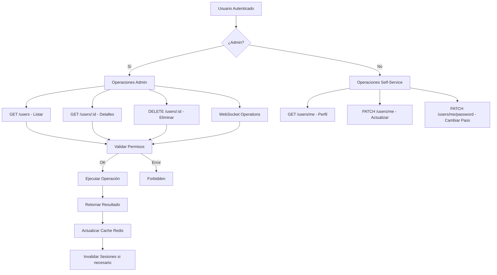
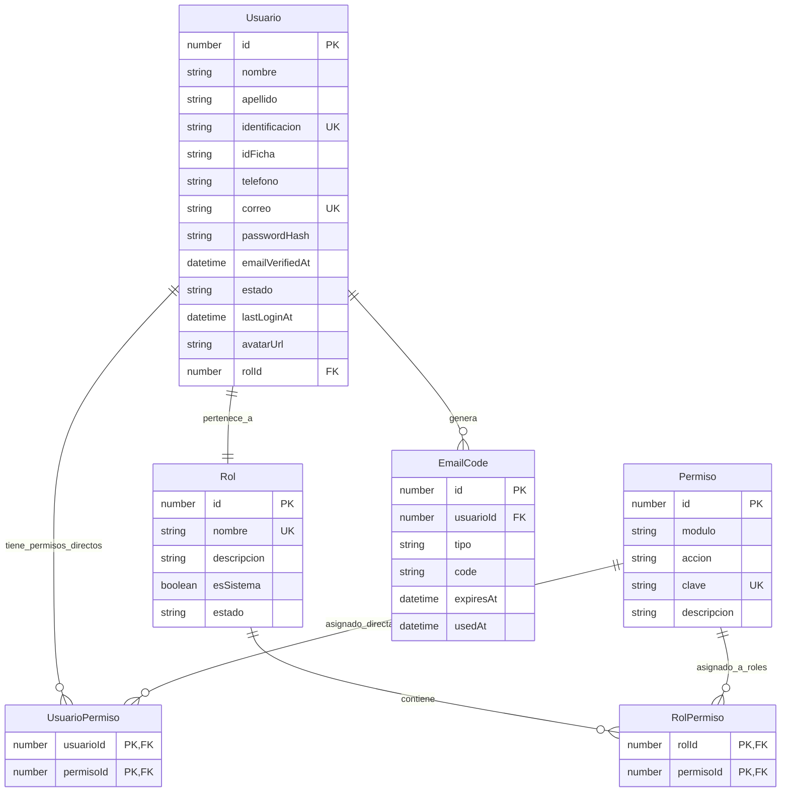

# API de Usuarios

## Visión General

El módulo de usuarios proporciona un sistema completo de gestión de usuarios, perfiles y administración de cuentas. Incluye funcionalidades para búsqueda avanzada, gestión de perfiles self-service, administración de usuarios por parte de administradores, y un sistema integrado con el módulo de autenticación para roles y permisos.

### Características Principales

- **Búsqueda Avanzada**: Filtrado por texto, rol y estado
- **Gestión de Perfiles**: Actualización self-service de información personal
- **Administración de Usuarios**: Creación, modificación y eliminación por administradores
- **Gestión de Roles y Estados**: Cambio de roles y estados de usuario con invalidación de sesiones
- **Cambio de Contraseñas**: Funcionalidad segura de cambio de contraseñas
- **WebSocket Support**: Comunicación en tiempo real para operaciones de usuarios
- **Soft Delete**: Eliminación lógica de usuarios
- **Integración con Auth**: Uso de roles y permisos del sistema de autenticación

## Endpoints HTTP

Todos los endpoints requieren autenticación JWT. Los endpoints de administración requieren permisos específicos.

### GET /users
Obtiene la lista de usuarios con filtros opcionales.

**Permisos requeridos:** `usuarios.ver`

**Parámetros de consulta:**
- `q`: string (opcional) - Búsqueda de texto en nombre, apellido, correo o identificación
- `rolId`: number (opcional) - Filtrar por ID de rol
- `estado`: string (opcional) - Filtrar por estado (activo, inactivo, bloqueado, pendiente_verificacion)

**Respuesta exitosa (200):**
```json
[
  {
    "id": 1,
    "nombre": "Juan",
    "apellido": "Pérez",
    "identificacion": "123456789",
    "idFicha": "FICHA001",
    "telefono": "+57 300 123 4567",
    "correo": "juan@example.com",
    "emailVerifiedAt": "2024-01-01T00:00:00.000Z",
    "estado": "activo",
    "lastLoginAt": "2024-01-15T10:30:00.000Z",
    "avatarUrl": "https://example.com/avatar.jpg",
    "rolId": 2,
    "rol": {
      "id": 2,
      "nombre": "Operario",
      "descripcion": "Usuario operativo",
      "esSistema": false,
      "estado": "activo"
    },
    "createdAt": "2024-01-01T00:00:00.000Z",
    "updatedAt": "2024-01-15T10:30:00.000Z"
  }
]
```

#### Respuestas de Error

- **401 Unauthorized**: Token JWT inválido o expirado
- **403 Forbidden**: Permisos insuficientes (se requiere usuarios.ver)

### GET /users/:id
Obtiene los detalles de un usuario específico. Este permiso 'usuarios.ver_perfil' permite ver perfiles individuales y todos los usuarios lo tienen por defecto, mientras que 'usuarios.ver' es para listar usuarios.

**Permisos requeridos:** `usuarios.ver_perfil`

**Parámetros de ruta:**
- `id`: number - ID del usuario

**Respuesta exitosa (200):** (igual que el objeto individual del array anterior)

#### Respuestas de Error

- **401 Unauthorized**: Token JWT inválido o expirado
- **403 Forbidden**: Permisos insuficientes (se requiere usuarios.ver_perfil)
- **404 Not Found**: Usuario no encontrado

### DELETE /users/:id
Elimina un usuario (soft delete).

**Permisos requeridos:** `usuarios.eliminar`

**Parámetros de ruta:**
- `id`: number - ID del usuario

**Respuesta exitosa (200):** (objeto del usuario eliminado)

#### Respuestas de Error

- **401 Unauthorized**: Token JWT inválido o expirado
- **403 Forbidden**: Permisos insuficientes (se requiere usuarios.eliminar)
- **404 Not Found**: Usuario no encontrado

### PATCH /users/:id
Actualiza la información de un usuario por parte de un administrador.

**Permisos requeridos:** `usuarios.editar`

**Parámetros de ruta:**
- `id`: number - ID del usuario

**Parámetros de entrada:**
```json
{
  "nombre": "string (opcional)",
  "apellido": "string (opcional)",
  "identificacion": "string (opcional)",
  "idFicha": "string (opcional)",
  "telefono": "string (opcional)",
  "correo": "string (opcional)",
  "estado": "string (opcional)",
  "avatarUrl": "string (opcional)"
}
```

**Validaciones:**
- Nombre: máximo 100 caracteres
- Apellido: máximo 100 caracteres
- Identificación: máximo 20 caracteres, única
- ID Ficha: máximo 20 caracteres
- Teléfono: formato válido, máximo 20 caracteres
- Correo: formato email válido, máximo 100 caracteres, único
- Estado: uno de 'activo', 'inactivo', 'bloqueado', 'pendiente_verificacion'
- Avatar URL: máximo 500 caracteres

**Respuesta exitosa (200):** (objeto del usuario actualizado)

#### Respuestas de Error

- **400 Bad Request**: Datos inválidos (formatos incorrectos)
- **401 Unauthorized**: Token JWT inválido o expirado
- **403 Forbidden**: Permisos insuficientes (se requiere usuarios.editar)
- **404 Not Found**: Usuario no encontrado
- **409 Conflict**: Correo o identificación ya en uso

### PATCH /users/:id/role
Cambia el rol de un usuario.

**Permisos requeridos:** `usuarios.cambiar_rol`

**Parámetros de ruta:**
- `id`: number - ID del usuario

**Parámetros de entrada:**
```json
{
  "rolId": "number"
}
```

**Validaciones:**
- rolId: debe existir en la tabla de roles

**Respuesta exitosa (200):** (objeto del usuario actualizado)

#### Respuestas de Error

- **400 Bad Request**: rolId inválido
- **401 Unauthorized**: Token JWT inválido o expirado
- **403 Forbidden**: Permisos insuficientes (se requiere usuarios.cambiar_rol)
- **404 Not Found**: Usuario no encontrado
### GET /users/me
Obtiene el perfil del usuario autenticado.

**Requiere:** Autenticación JWT (sin permisos específicos)

**Respuesta exitosa (200):** (objeto del usuario actual, sin passwordHash)

#### Respuestas de Error

- **401 Unauthorized**: Token JWT inválido o expirado

### PATCH /users/me
Actualiza el perfil del usuario autenticado.

**Requiere:** Autenticación JWT (sin permisos específicos)

**Parámetros de entrada:**
```json
{
  "nombre": "string (opcional)",
  "apellido": "string (opcional)",
  "idFicha": "string (opcional)",
  "telefono": "string (opcional)",
  "correo": "string (opcional)",
  "avatarUrl": "string (opcional)"
}
```

**Validaciones:**
- Nombre: máximo 100 caracteres
- Apellido: máximo 100 caracteres
- ID Ficha: máximo 20 caracteres
- Teléfono: formato válido, máximo 20 caracteres
- Correo: formato email válido, máximo 100 caracteres, único
- Avatar URL: máximo 500 caracteres

**Respuesta exitosa (200):** (objeto del usuario actualizado)

#### Respuestas de Error

- **400 Bad Request**: Datos inválidos (formatos incorrectos)
- **401 Unauthorized**: Token JWT inválido o expirado
- **409 Conflict**: Correo electrónico ya en uso

### PATCH /users/me/password
Cambia la contraseña del usuario autenticado.

**Requiere:** Autenticación JWT (sin permisos específicos)

**Parámetros de entrada:**
```json
{
  "oldPassword": "string",
  "newPassword": "string"
}
```

**Validaciones:**
- Contraseña actual: requerida
- Nueva contraseña: mínimo 8 caracteres, debe contener mayúscula, minúscula y número

**Respuesta exitosa (200):**
```json
{
  "message": "Contraseña actualizada exitosamente"
}
```

#### Respuestas de Error

- **400 Bad Request**: Contraseña actual incorrecta, nueva contraseña no cumple requisitos
- **401 Unauthorized**: Token JWT inválido o expirado

### POST /users/me/avatar
Carga una imagen de perfil para el usuario autenticado.

**Requiere:** Autenticación JWT (sin permisos específicos)

**Parámetros de entrada:**
- `file`: archivo (multipart/form-data) - Imagen de perfil (formatos permitidos: JPG, PNG, máximo 5MB)

**Regla de nombramiento de carpeta:** Las imágenes se almacenan en carpetas nombradas con el formato `identificacion_nombre`, donde `identificacion` es la identificación del usuario y `nombre` es el nombre del usuario (ejemplo: `123456789_Juan`).

**Respuesta exitosa (200):**
```json
{
  "avatarUrl": "https://example.com/uploads/avatars/123456789_Juan/avatar.jpg"
}
```

#### Respuestas de Error

- **400 Bad Request**: Archivo inválido (formato no soportado, tamaño excedido)
- **401 Unauthorized**: Token JWT inválido o expirado
- **413 Payload Too Large**: Archivo demasiado grande
- **415 Unsupported Media Type**: Tipo de archivo no permitido

## Endpoints WebSocket

**Namespace:** `/users`

### users:findAll
Obtiene la lista de usuarios con filtros.

**Permisos requeridos:** `usuarios.ver`

**Parámetros:**
```json
{
  "q": "string (opcional)",
  "rolId": "number (opcional)",
  "estado": "string (opcional)"
}
```

**Eventos emitidos:**
- `users:list`: Lista de usuarios
- `error`: En caso de error

### users:findById
Obtiene los detalles de un usuario específico.

**Permisos requeridos:** `usuarios.ver`

**Parámetros:**
```json
{
  "id": "number"
}
```

**Eventos emitidos:**
- `users:detail`: Detalles del usuario
- `error`: En caso de error

### users:remove
Elimina un usuario.

**Permisos requeridos:** `usuarios.eliminar`

**Parámetros:**
```json
{
  "id": "number"
}
```

**Eventos emitidos:**
- `users:removed`: Usuario eliminado
- `users:updated`: Notificación a todos los clientes conectados
- `error`: En caso de error

### users:updated
Notifica actualizaciones en usuarios.

**Permisos requeridos:** ninguno (emisión automática)

**Parámetros:** ninguno

**Eventos emitidos:**
- `users:updated`: Datos del usuario actualizado
- `error`: En caso de error

### users:roleChanged
Notifica cambios de rol en usuarios.

**Permisos requeridos:** ninguno (emisión automática)

**Parámetros:** ninguno

**Eventos emitidos:**
- `users:roleChanged`: Datos del usuario con rol cambiado
- `error`: En caso de error
## Entidades Relacionadas

### Usuario
```typescript
{
  id: number;
  nombre: string;
  apellido: string;
  identificacion: string; // único
  idFicha?: string;
  telefono?: string;
  correo: string; // único
  passwordHash: string;
  emailVerifiedAt?: Date;
  estado: string; // 'activo' | 'inactivo' | 'bloqueado' | 'pendiente_verificacion'
  lastLoginAt?: Date;
  avatarUrl?: string;
  rolId?: number;
  rol?: Rol;
  usuarioPermisos?: UsuarioPermiso[];
  emailCodes?: EmailCode[];
  createdAt: Date;
  updatedAt: Date;
  deletedAt?: Date; // soft delete
}
```

### Rol
```typescript
{
  id: number;
  nombre: string;
  descripcion?: string;
  esSistema: boolean;
  estado: string;
  usuarios?: Usuario[];
  rolPermisos?: RolPermiso[];
  createdAt: Date;
  updatedAt: Date;
}
```

### Permiso
```typescript
{
  id: number;
  modulo: string;
  accion: string;
  clave: string; // formato: "modulo.accion"
  descripcion?: string;
  rolPermisos?: RolPermiso[];
  usuarioPermisos?: UsuarioPermiso[];
  createdAt: Date;
  updatedAt: Date;
}
```

### UsuarioPermiso
```typescript
{
  usuarioId: number;
  permisoId: number;
  usuario?: Usuario;
  permiso?: Permiso;
}
```

## Lógica de Negocio

### Búsqueda Avanzada
- **Campos de búsqueda**: nombre, apellido, correo, identificación (ILIKE)
- **Filtros**: rolId, estado
- **Ordenamiento**: Por fecha de creación descendente
- **Relaciones**: Incluye información del rol

### Creación de Usuarios por Admin
- **Validación de unicidad**: Correo e identificación
- **Contraseña**: Si no se proporciona, se genera automáticamente (12 caracteres alfanuméricos)
- **Estado inicial**: 'activo'
- **Rol por defecto**: Invitado (ID 5)
- **Email de bienvenida**: Se envía con credenciales

### Actualización de Perfiles
- **Campos permitidos**: nombre, apellido, idFicha, telefono, correo, avatarUrl
- **Reset de verificación**: Si se cambia el correo, se resetea emailVerifiedAt
- **Validaciones**: Unicidad de correo

### Cambio de Roles
- **Invalidación de caché**: Se limpia el caché de permisos del usuario
- **Cierre de sesiones**: Se eliminan todas las sesiones activas del usuario
- **Mensaje**: Indica que el usuario debe volver a iniciar sesión

### Cambio de Estados
- **Estados disponibles**: activo, inactivo, bloqueado, pendiente_verificacion
- **Cierre de sesiones**: Para estados no activos, se cierran todas las sesiones
- **Mensaje**: Indica el cambio de estado y cierre de sesiones si aplica

### Cambio de Contraseñas
- **Validación**: Verificación de contraseña actual
- **Hashing**: bcrypt con salt rounds 10
- **Requisitos**: Mínimo 8 caracteres, mayúscula, minúscula, número

### Soft Delete
- **Campo**: deletedAt
- **Recuperación**: Método restore disponible
- **Filtros**: Las consultas excluyen usuarios eliminados (deletedAt IS NULL)

## Validaciones

### CreateUserByAdminDto
- nombre: string, max 100 chars
- apellido: string, max 100 chars
- identificacion: string, max 20 chars, único
- idFicha: string opcional, max 20 chars
- telefono: string opcional, regex ^[0-9+\-\s()]+$, max 20 chars
- correo: email válido, max 100 chars, único
- password: string opcional, min 8 chars, max 100 chars
- rolId: number opcional

### UpdateProfileDto
- nombre: string opcional, max 100 chars
- apellido: string opcional, max 100 chars
- idFicha: string opcional, max 20 chars
- telefono: string opcional, regex ^[0-9+\-\s()]+$, max 20 chars
- correo: email opcional, max 100 chars, único
- avatarUrl: string opcional, max 500 chars

### ChangePasswordDto
- oldPassword: string requerido
- newPassword: string requerido, min 8 chars, regex /^(?=.*[a-z])(?=.*[A-Z])(?=.*\d)/

### ChangeRoleDto
- rolId: number opcional

### ChangeStatusDto
- estado: enum UserStatus (activo, inactivo, bloqueado, pendiente_verificacion)

## Diagramas

### Diagrama de Flujo de Gestión de Usuarios



### Diagrama de Entidades



## Respuestas de Error

### Códigos de Estado HTTP

- **400 Bad Request**: Datos inválidos, formatos incorrectos, unicidad violada, contraseña actual incorrecta
- **401 Unauthorized**: Token JWT inválido o expirado
- **403 Forbidden**: Permisos insuficientes
- **404 Not Found**: Usuario no encontrado
- **409 Conflict**: Correo o identificación ya existen

### Estructura de Errores

```json
{
  "statusCode": 400,
  "message": "Validation failed",
  "error": "Bad Request",
  "details": [
    {
      "field": "correo",
      "constraints": {
        "isEmail": "correo must be a valid email"
      }
    }
  ]
}
```

### Manejo de Errores Personalizados

- **BadRequestException**: Datos inválidos o reglas de negocio violadas
- **UnauthorizedException**: No autorizado
- **ForbiddenException**: Permisos insuficientes
- **NotFoundException**: Recurso no encontrado
- **ConflictException**: Conflictos de datos (unicidad)